> Authorized penetration testing project conducted in an isolated VMware lab environment.
> All testing was performed on intentionally vulnerable systems owned and operated by the tester.

## ⚠️ Legal Disclaimer
This project was conducted entirely within a self-contained lab environment using:
- Kali Linux (Attacker VM)
- Metasploitable 2 with DVWA (Target VM)
- VMware Host-Only isolated network

No real systems, public IPs, or third-party services were targeted.
All activities comply with ethical hacking principles and applicable laws.

---

# 🛡️ Web Application Penetration Testing Lab


> **Authorized penetration test conducted entirely within a self-contained
> isolated VMware lab environment. All systems are owned and operated by
> the tester. No real systems or third-party services were involved.**

---

## 📋 Table of Contents

- [Project Overview](#project-overview)
- [Lab Architecture](#lab-architecture)
- [Tools Used](#tools-used)
- [Vulnerabilities Tested](#vulnerabilities-tested)
- [Methodology](#methodology)
- [Key Findings](#key-findings)
- [Screenshots](#screenshots)
- [Remediation Summary](#remediation-summary)
- [Skills Demonstrated](#skills-demonstrated)
- [Legal Disclaimer](#legal-disclaimer)

---

## 📌 Project Overview

This project documents a complete web application penetration test
performed against **DVWA (Damn Vulnerable Web Application)** hosted
on **Metasploitable 2** in an isolated VMware lab.

The project covers the full penetration testing lifecycle:Reconnaissance → Manual Exploitation → Tool-Assisted Testing
→ Automated Scanning → Evidence Collection → Professional Reporting

### What This Project Demonstrates
- Real-world pentesting workflow from zero to final report
- Manual vulnerability identification before tool confirmation
- Professional evidence collection and documentation
- Chained attack scenario construction
- Remediation guidance at developer-actionable level

### Project Stats
| Metric | Value |
|--------|-------|
| Total Vulnerabilities Found | 9 |
| Critical Severity | 2 |
| High Severity | 3 |
| Testing Phases Completed | 9 |
| Tools Used | 6 |
| Screenshots Collected | 58 |
| Report Pages | 15+ |

---

## 🏗️ Lab Architecture

```
┌─────────────────────────────────────────────────┐
│            VMware Host-Only Network             │
│                 192.168.56.0/24                 │
│                                                 │
│   ┌──────────────────┐   ┌──────────────────┐   │
│   │   Kali Linux     │   │  Metasploitable  │   │
│   │   (Attacker)     │◄─►│   2  (Target)    │   │
│   │  192.168.56.128  │   │  192.168.56.129  │   │
│   │                  │   │                  │   │
│   │  Tools:          │   │  Services:       │   │
│   │  • Nmap          │   │  • Apache 2.2.8  │   │
│   │  • Burp Suite    │   │  • MySQL 5.0.51  │   │
│   │  • SQLMap        │   │  • PHP 5.2.4     │   │
│   │  • Hydra         │   │  • DVWA          │   │
│   │  • OWASP ZAP     │   │  • OpenSSH 4.7   │   │
│   └──────────────────┘   └──────────────────┘   │
│                                                 │
│   ════════════ FULLY ISOLATED ═════════════════ │
│          Zero internet connectivity             │
└─────────────────────────────────────────────────┘
```

### Host Machine Specs
- **CPU:** AMD Ryzen 7 4800H
- **RAM:** 16GB (4–6GB allocated to Kali, 1GB to Metasploitable)
- **GPU:** NVIDIA RTX 3050
- **Hypervisor:** VMware Workstation
- **Network:** VMware VMnet1 Host-Only (isolated)

---

## 🔧 Tools Used

| Tool | Purpose | Phase |
|------|---------|-------|
| **Nmap** | Port scanning, service/version enumeration, OS detection | Reconnaissance |
| **Burp Suite Community** | HTTP proxy, request interception, Repeater, Intruder | All phases |
| **SQLMap** | Automated SQL injection detection and exploitation | SQL Injection |
| **Hydra** | Command-line brute force authentication testing | Weak Auth |
| **OWASP ZAP** | Automated vulnerability scanning, spider, active scan | Automated Scan |
| **Firefox DevTools** | Cookie inspection, session analysis, JS console testing | Session/Cookie |

---

## 🎯 Vulnerabilities Tested

| ID | Vulnerability | Severity | CVSS | OWASP 2021 |
|----|---------------|----------|------|------------|
| F1 | SQL Injection | 🔴 Critical | 9.8 | A03 — Injection |
| F2 | Reflected XSS | 🟠 High | 7.4 | A03 — Injection |
| F3 | Stored XSS | 🔴 Critical | 8.2 | A03 — Injection |
| F4 | Weak Authentication / No Brute Force Controls | 🟠 High | 7.5 | A07 — Auth Failures |
| F5 | Insecure Session / Cookie Configuration | 🟠 High | 7.3 | A07 — Auth Failures |
| F6 | Missing Content Security Policy | 🟡 Medium | 5.4 | A05 — Misconfiguration |
| F7 | Missing X-Frame-Options Header | 🟡 Medium | 4.3 | A05 — Misconfiguration |
| F8 | Missing CSRF Token | 🟡 Medium | 4.3 | A01 — Access Control |
| F9 | Server Version Disclosure | 🔵 Low | 2.6 | A05 — Misconfiguration |

---

## 📐 Methodology

This assessment followed the **OWASP Testing Guide v4.2** and
**PTES (Penetration Testing Execution Standard)**.

### Testing Approach
```
Phase 1 ── Reconnaissance
└── Nmap: basic → version → aggressive → web-targeted scans
Identified 10+ open services, OS fingerprint, web stackPhase 2 ── DVWA Configuration
└── Authenticated access, security level set, modules verifiedPhase 3 ── Manual Vulnerability Testing (for each module)
├── Step 1: Establish normal baseline behavior
├── Step 2: Inject incremental payloads
├── Step 3: Confirm vulnerability with proof
├── Step 4: Escalate to demonstrate real impact
└── Step 5: Capture evidence at every stagePhase 4 ── Tool-Assisted Exploitation
├── Burp Suite: all phases — intercept, replay, attack
├── SQLMap: database enumeration and credential dump
└── Hydra: brute force authentication confirmationPhase 5 ── Automated Scanning
└── OWASP ZAP: spider + active scan (authenticated)
Compared results against manual findingsPhase 6 ── Documentation
└── Professional report with CVSS scores,
OWASP mapping, evidence references,
developer-actionable remediation
```

### Key Principle — Manual Before Automated
Every vulnerability was manually confirmed before running
automated tools. This approach demonstrates genuine understanding
rather than tool-dependency, and reveals exploitation depth that
automated scanners cannot capture.

---

## 🔍 Key Findings

### Finding 1 — SQL Injection (Critical — CVSS 9.8)

**Location:** `/dvwa/vulnerabilities/sqli/?id=`

The `id` parameter was passed directly into MySQL queries without
sanitization. Manual UNION-based injection extracted the complete
`users` table including MD5-hashed credentials. SQLMap independently
confirmed exploitability across multiple injection types
(boolean-based, error-based, UNION, time-based).

```sql

-- Payload used to dump all credentials:
1' UNION SELECT user,password FROM users -- --- Result: admin:5f4dcc3b5aa765d61d8327deb882cf99
--         (MD5 hash of 'password')
```

**Fix:** Parameterized queries / prepared statements.

---

### Finding 2 — Reflected XSS (High — CVSS 7.4)

**Location:** `/dvwa/vulnerabilities/xss_r/?name=`

The `name` parameter was reflected raw into the HTML response.
Multiple payloads confirmed — including a cookie theft simulation
showing `document.cookie` accessible via JavaScript, and a filter
bypass using the `onerror` event handler on an `img` tag.

```html

<!-- Cookie theft payload: -->
<script>alert(document.cookie)</script><!-- Filter bypass: -->

```

**Fix:** `htmlspecialchars()` output encoding + Content Security Policy.

---

### Finding 3 — Stored XSS (Critical — CVSS 8.2)

**Location:** `/dvwa/vulnerabilities/xss_s/` (guestbook)

Injected payload persisted in the MySQL database and fired
automatically on every subsequent page load — for all users.
The HTML `maxlength` attribute on the Name field was bypassed
using Burp Suite Repeater, confirming client-side controls
provide zero server-side protection.

```html

<!-- Payload submitted via guestbook message field: -->
<script>alert(document.cookie)</script>

<!-- Fires for every visitor — no interaction required -->
```

**Fix:** Server-side output encoding + input validation +
prepared statements.

---

### Finding 4 — Weak Authentication (High — CVSS 7.5)

**Location:** `/dvwa/vulnerabilities/brute/`

No account lockout, rate limiting, or CAPTCHA present.
Credentials transmitted via GET method — visible in server logs
and browser history. Using Burp Suite Intruder and a 10-password
wordlist, the correct password was recovered in under 3 seconds.
Hydra independently confirmed the same result from the CLI.

```bash
# Hydra result:
[80][http-get-form] login: admin   password: password
```

**Fix:** Lockout policy + rate limiting + MFA + POST over HTTPS.

---

### Finding 5 — Insecure Session/Cookie Config (High — CVSS 7.3)

**Location:** All application pages

All session cookies were missing HttpOnly, Secure, and SameSite
flags. Session ID was not regenerated after login (session
fixation). The `security` cookie was tampered via Burp to bypass
application-level controls. Session hijacking was demonstrated
by copying the PHPSESSID into a separate browser and gaining
full authenticated access without credentials.

Set-Cookie: PHPSESSID=abc123; path=/
-- Missing: HttpOnly; Secure; SameSite=Strict

**Fix:** `session_set_cookie_params()` with all flags +
`session_regenerate_id(true)` after login.

---

### Critical Attack Chain

```
The most significant finding was the combination of
Stored XSS + missing HttpOnly flag + no session regeneration:
① Attacker submits XSS payload to guestbook
↓
② Payload stored in database permanently
↓
③ Every visitor's page load executes the script
↓
④ document.cookie readable (HttpOnly missing)
↓
⑤ Session token exfiltrated silently
↓
⑥ Attacker replays token — full account access
↓
⑦ SQLi used to dump entire database
↓
⑧ Complete application compromise — no password needed
```

---

## 📸 Screenshots

### SQL Injection
| Screenshot | Description |
|------------|-------------|
| 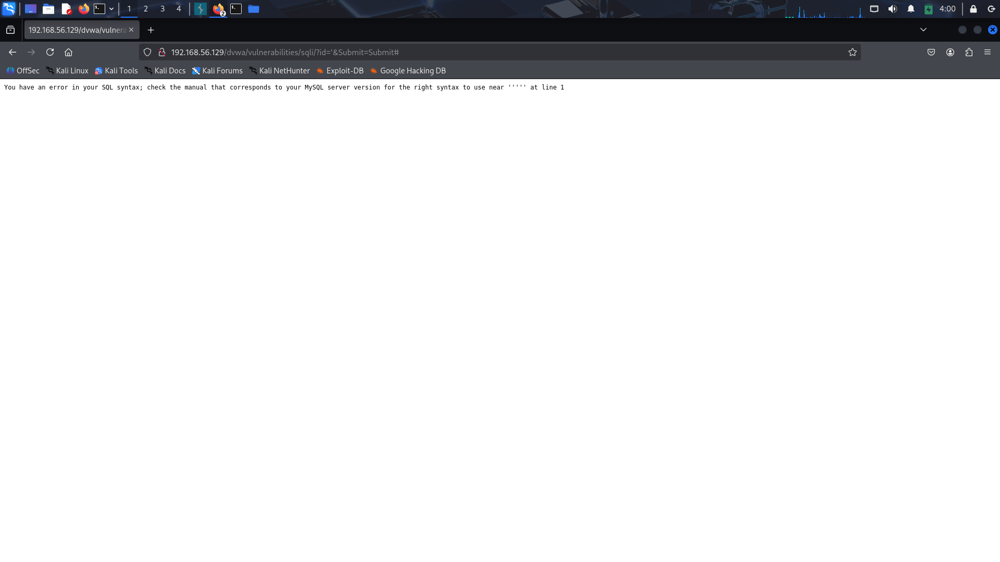 | SQL syntax error confirms injection |
| 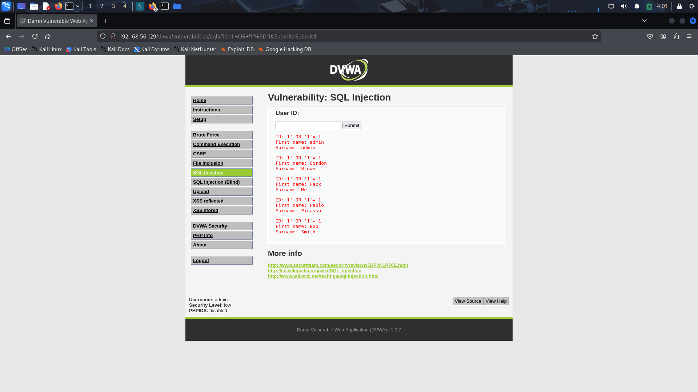 | All records returned via OR 1=1 |
| 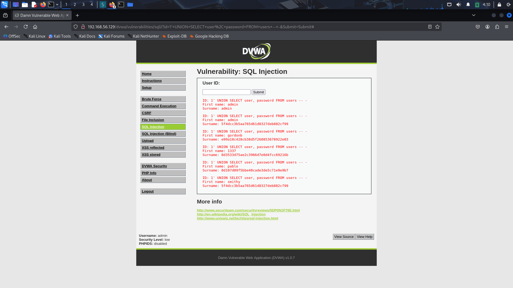 | Password hashes extracted manually |
| 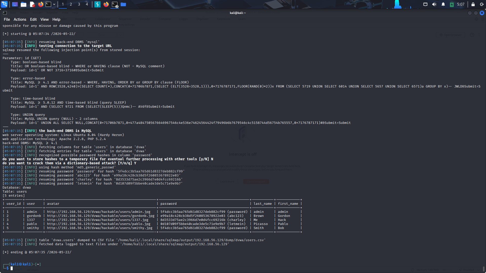 | Full table dump via SQLMap |

### Cross-Site Scripting
| Screenshot | Description |
|------------|-------------|
| 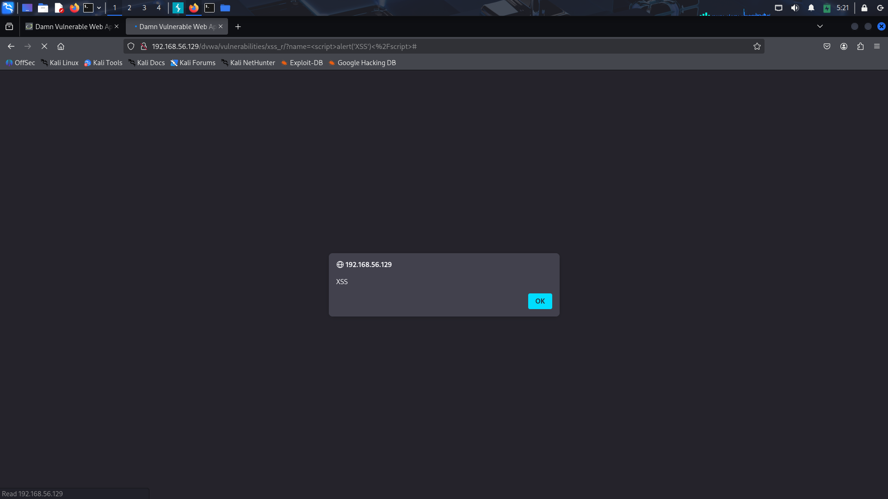 | Reflected XSS popup confirmed |
| 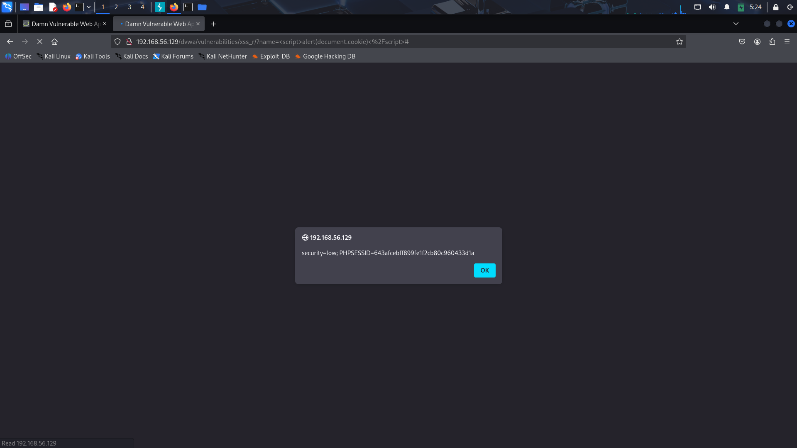 | Session cookie exposed via XSS |
| 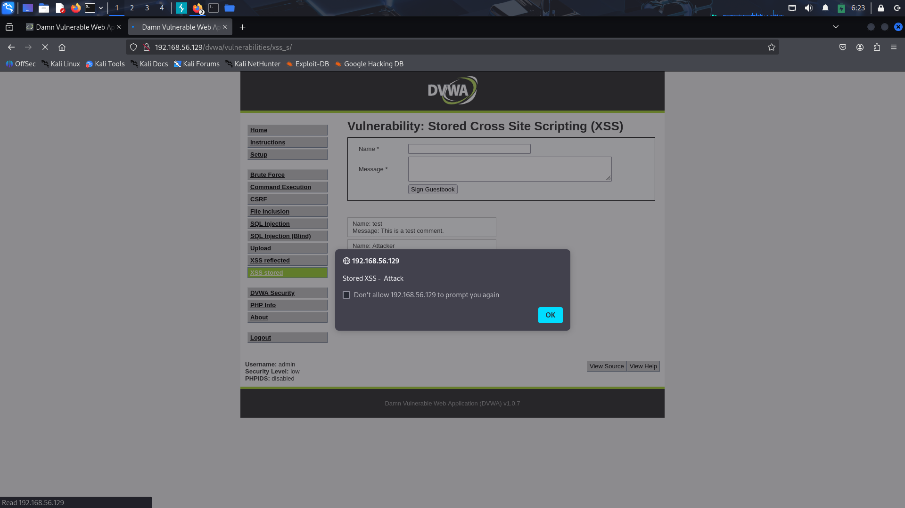 | Stored XSS fires on every page load |
| 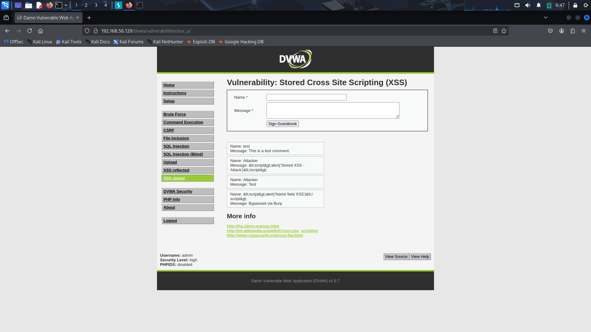 | Client maxlength bypassed via Burp |

### Authentication & Session
| Screenshot | Description |
|------------|-------------|
| 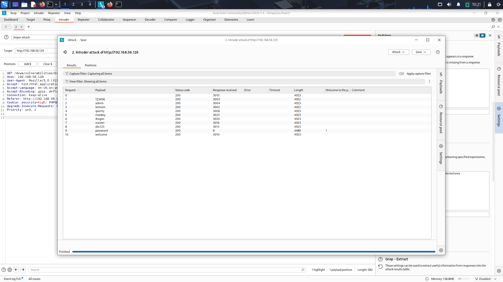 | Password found via response length |
| 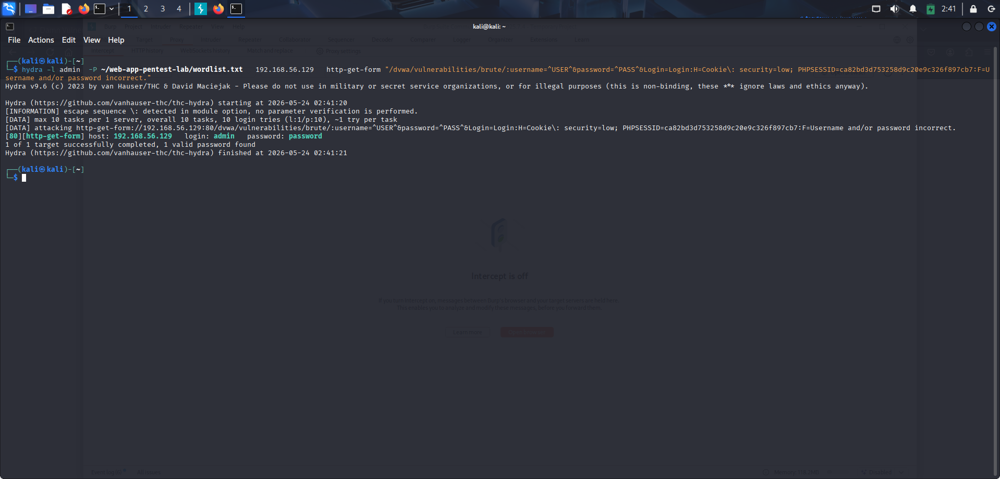 | Hydra CLI brute force success |
| 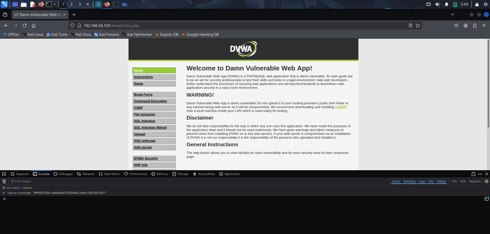 | Session cookie readable via JS |
| 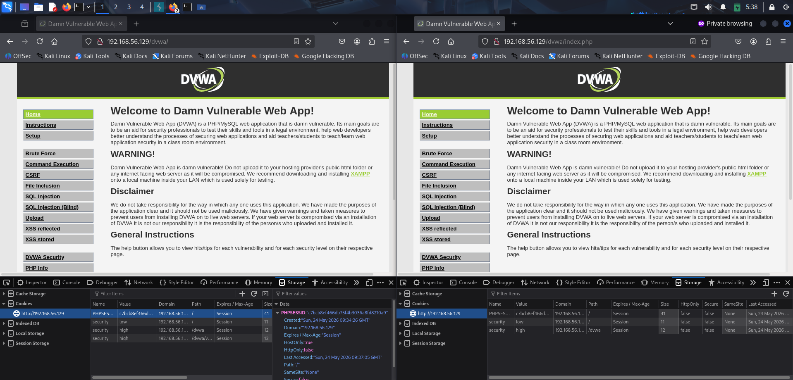 | Account accessed without credentials |

### Automated Scan
| Screenshot | Description |
|------------|-------------|
| 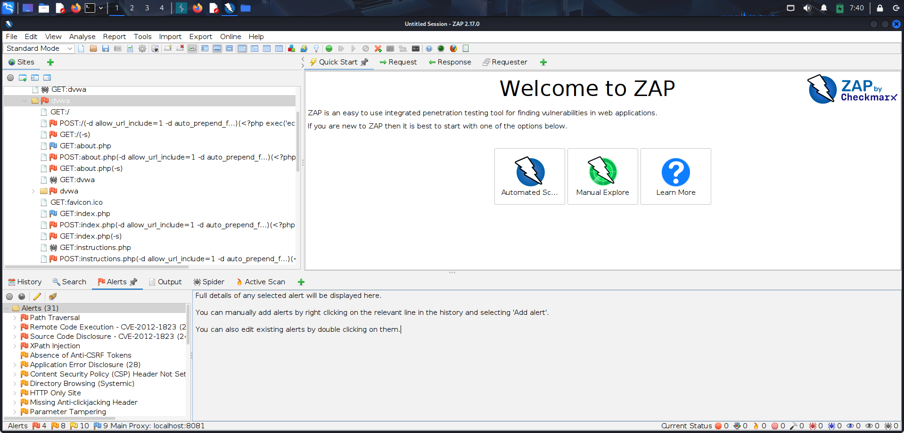 | OWASP ZAP findings overview |
| 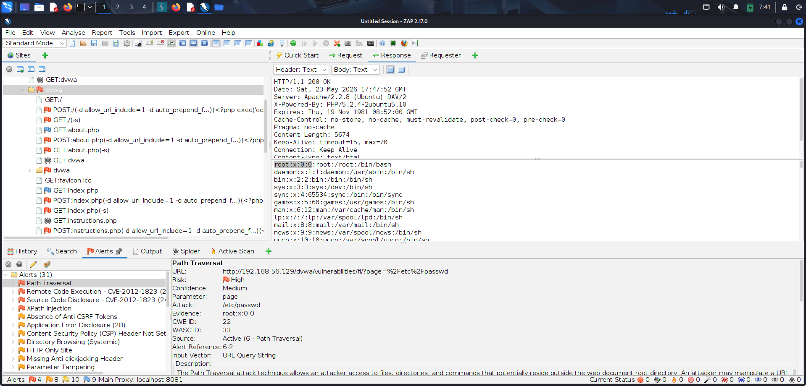 | ZAP independently confirms SQLi |

---

## 🔧 Remediation Summary

| Priority | Finding | Fix | Effort |
|----------|---------|-----|--------|
| 🔴 Immediate | SQL Injection | Parameterized queries | 1 day |
| 🔴 Immediate | Stored XSS | htmlspecialchars() output encoding | 1 day |
| 🟠 High | Reflected XSS | htmlspecialchars() + CSP header | 1 day |
| 🟠 High | Weak Auth | Lockout + rate limit + MFA | 2 days |
| 🟠 High | Insecure Cookies | Cookie flags + session_regenerate_id() | 0.5 days |
| 🟡 Medium | Missing Headers | CSP + X-Frame-Options + CSRF tokens | 1 day |
| 🔵 Low | Version Disclosure | ServerTokens Prod in Apache config | 0.5 hours |

### Two Lines That Fix the Most

```php
// Fixes SQL Injection — replaces string concatenation:
$stmt = $pdo->prepare("SELECT * FROM users WHERE id = ?");
$stmt->execute([$id]);

// Fixes XSS — encode before output:
echo htmlspecialchars($input, ENT_QUOTES, 'UTF-8');
```

---

## 💡 Skills Demonstrated

### Technical Skills
- **Network Reconnaissance** — Nmap scan types, service fingerprinting, OS detection
- **Web Application Testing** — Manual SQLi, XSS (Reflected + Stored), auth testing
- **Proxy Usage** — Burp Suite intercept, Repeater, Intruder configuration
- **Automated Testing** — SQLMap, Hydra, OWASP ZAP spider + active scan
- **Session Analysis** — Cookie flag inspection, session fixation, hijacking POC
- **Evidence Collection** — Systematic screenshot workflow, scan output preservation

### Methodology Skills
- OWASP Top 10 2021 application and mapping
- PTES penetration testing lifecycle
- CVSS v3.1 scoring
- CWE vulnerability classification
- Manual-first approach before automation
- Chained attack scenario construction

### Professional Skills
- Professional pentest report writing
- Executive summary for non-technical audience
- Developer-actionable remediation guidance
- Evidence indexing and organization
- GitHub project documentation

---

## 📂 Repository Structure

```
web-app-pentest-lab/
│
├── README.md                          ← You are here
│
├── report/
│   └── penetration-test-report.md    ← Full professional report
│
├── scans/
│   ├── nmap-basic.txt                ← Port discovery
│   ├── nmap-version.txt              ← Service versions
│   ├── nmap-aggressive.txt           ← OS detection
│   ├── nmap-web.txt                  ← Web-targeted scan
│   ├── hydra-output.txt              ← Brute force results
│   ├── zap-report.html               ← ZAP automated scan
│   └── sqlmap-output/                ← SQLMap findings
│
├── screenshots/
│   ├── recon/                        ← 14 recon screenshots
│   ├── sqli/                         ← 13 SQLi screenshots
│   ├── xss-reflected/                ← 10 reflected XSS
│   ├── xss-stored/                   ← 7 stored XSS
│   ├── weak-auth/                    ← 11 auth testing
│   └── cookies/                      ← 10 session/cookie
│
└── notes/
├── methodology.md                ← Detailed methodology
├── findings-summary.md           ← Findings table
└── evidence-index.md             ← Screenshot mapping
```

---

## ⚖️ Legal Disclaimer

```
IMPORTANT — READ BEFORE USE
This project was conducted exclusively within a self-contained isolated VMware lab environment for educational purposes.
✅ All systems tested are owned and operated by the tester
✅ Network is VMware Host-Only — zero internet connectivity
✅ No real systems, public IPs, or third-party services involved
✅ No real user data was accessed or collected
✅ All activities comply with ethical hacking principles
❌ Do NOT use these techniques against systems you do not own
❌ Do NOT use these techniques without explicit written authorization
❌ Unauthorized penetration testing is illegal in most jurisdictions
The techniques documented here are for educational understanding of web application security and defensive practices only.
For legal penetration testing, always obtain written authorization before testing any system.
```

---

## 📚 References

- [OWASP Top 10 2021](https://owasp.org/Top10/)
- [OWASP Testing Guide v4.2](https://owasp.org/www-project-web-security-testing-guide/)
- [PTES Standard](http://www.pentest-standard.org/)
- [CVSS v3.1 Calculator](https://www.first.org/cvss/calculator/3.1)
- [CWE Database](https://cwe.mitre.org/)
- [Burp Suite Documentation](https://portswigger.net/burp/documentation)
- [OWASP ZAP Documentation](https://www.zaproxy.org/docs/)

---

## 👤 Author

**Rushil Patel**

[](https://github.com/Rushilpatel50)
[](https://linkedin.com/in/rushil-patel-998669402/)

---
*Conducted in isolated lab — for educational purposes only*
